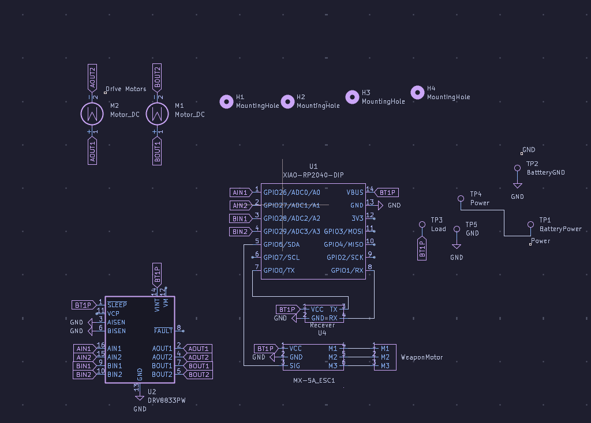
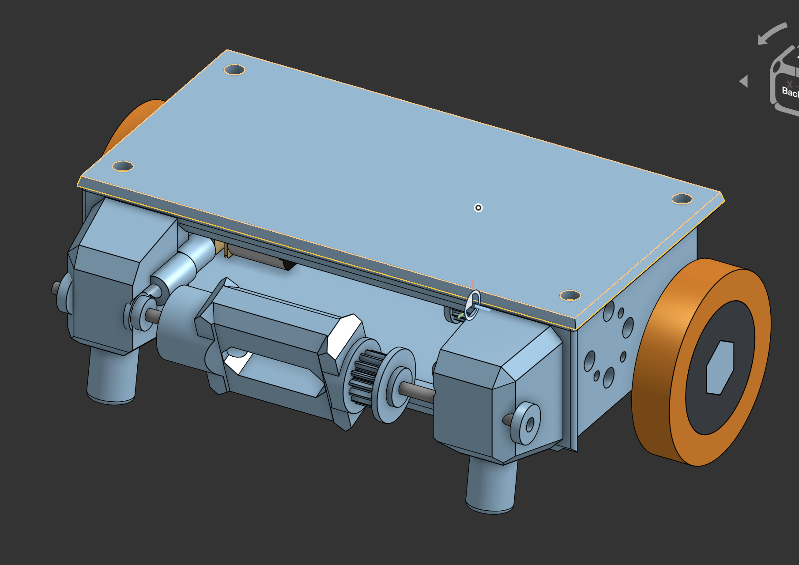

# barrel-roll

## What is this
Barrel roll is a 150g combat robot that has a 2.706693 inch long bar spinner. There are two options for the microcontroller of the robot. Right now I have a pcb designed with a RP2040 in mind. I also have a version of the schematic/firmware with an esp32 as the microcontroller.

## PCB

Above are the images of the PCB version of the electrical components of the robot(To be honest right now it feels more like a glorified pinout board)

The above is a picture of the schematic for anyone using the DOIT esp32 devkit v1. I made this one because it could cut down on the cost of the project as a whole.

## Assembly
Onshape link: https://cad.onshape.com/documents/4d0cf8c11fd66439fc3e30b0/w/a8064dfad10d7d33689fe150/e/b5006982824e862bc7271070?renderMode=0&uiState=69e65a2ccd9a40dd9e183c54

A note about the assembly: I could not find 3d models of the bearings I wanted to use so I made a model with the same dimensions as the bearings. /n
#### 3D printing
To assemble the barrel-roll you first need to print out the parts specified in the onshape document. All the parts in the FINAL folder must be printed There will be a note with the quantity and the infill amount. The fillament for all of these will be up to you. I will personally be using TPU.
#### PCB
IF you are using a PCB to create Barrel Roll then you need to get the Gerbers.zip from barrel-roll folder in the repo. After this you need to go to your preferred PCB manufacteror of your choice to have it manufactured.

#### No PCB
If you are not using a PCB your costs will be a little bit lower since you don't need to by the PCB. To find the wiring diagram you can look in the barrel-roll-nopcb folder of the repo. This is a kicad project that contains a wiring diagram if you have a DOIT ESP32 devkit 1(The esp32 from the electronics kits that commonly come from hackclub events).

#### Assembling the shell
To assemble the MAIN_SHELL with the SIDE_SHELL you can use the bowtie connector along side the fastening rod to attach each part of the SIDE_SHELL without the use of metal connectors. However you may find that securing the weapon/shaft/shaft caps and belt may be easier than attaching SIDE_SHELL to MAIN_SHELL immediately.

## Usage
To use barrel roll you need to connect the radio recever to the radio sender.
After this you should be able to control the robot using your controller.

## BOM
|Reference|Qty|Part           |Footprint                                                 |Supplier                                                                                                                                                                                                                                                                                                                                                                                                                                                                                                                                                                                                                                                                          |Unit Price|Total Price|FIELD8|SubTotal:      |$95.23 |
|---------|---|---------------|----------------------------------------------------------|----------------------------------------------------------------------------------------------------------------------------------------------------------------------------------------------------------------------------------------------------------------------------------------------------------------------------------------------------------------------------------------------------------------------------------------------------------------------------------------------------------------------------------------------------------------------------------------------------------------------------------------------------------------------------------|----------|-----------|------|---------------|-------|
|U1       |1  |XIAO-RP2040-DIP|Seeed Studio XIAO Series Library:XIAO-RP2040-DIP          |https://vilros.com/products/raspberry-pi-pico?src=raspberrypi                                                                                                                                                                                                                                                                                                                                                                                                                                                                                                                                                                                                                     |$4.00     |$4.00      |      |Shipping:      |$35.37 |
|U2       |1  |DRV8833PW      |Package_DIP:DIP-16_W7.62mm                                |https://www.pololu.com/product/2130/resources                                                                                                                                                                                                                                                                                                                                                                                                                                                                                                                                                                                                                                     |$10.95    |$10.95     |      |Tax:           |$4.05  |
|U3       |1  |WeaponMotor    |Connector_PinHeader_2.54mm:PinHeader_1x03_P2.54mm_Vertical|https://itgresa.com/product/d2822-8-brushless-motor-outrunner/                                                                                                                                                                                                                                                                                                                                                                                                                                                                                                                                                                                                                    |$15.49    |$15.49     |      |Total:         |$134.65|
|U4       |1  |Recever        |Connector_PinHeader_2.54mm:PinHeader_1x04_P2.54mm_Vertical|https://radiomasterrc.com/collections/elrs-receivers/products/xr1-nano-multi-frequency-expresslrs-receiverr                                                                                                                                                                                                                                                                                                                                                                                                                                                                                                                                                                       |$11.99    |$11.99     |      |Hours Required:|26.93  |
|n/a      |2  |Bearings       |n/a                                                       |https://www.aliexpress.us/item/2271799817221155.html?spm=a2g0o.productlist.main.9.6bf0uxmMuxmMSm&algo_pvid=0084ef23-d777-4396-9fe6-be60675d223d&algo_exp_id=0084ef23-d777-4396-9fe6-be60675d223d-8&pdp_ext_f=%7B%22order%22%3A%222%22%2C%22eval%22%3A%221%22%2C%22fromPage%22%3A%22search%22%7D&pdp_npi=6%40dis%21USD%217.46%216.48%21%21%217.46%216.48%21%402101df0e17764670198046154ec5ac%2130000000002742954%21sea%21US%217446788148%21ABX%211%210%21n_tag%3A-29910%3Bd%3A67ce4d4a%3Bm03_new_user%3A-29895%3BpisId%3A5000000204886261&curPageLogUid=5TuNOIFeizbl&utparam-url=scene%3Asearch%7Cquery_from%3A%7Cx_object_id%3A20000003535907%7C_p_origin_prod%3A#nav-descriptionn|$0.65     |$1.30      |      |               |       |
|n/a      |1  |Shaft          |n/a                                                       |https://www.aliexpress.us/item/3256805290944526.html?spm=a2g0o.productlist.main.5.a97817abGkl4fC&algo_pvid=8facb9d5-b650-4910-bfe5-7eef344e1a3e&algo_exp_id=8facb9d5-b650-4910-bfe5-7eef344e1a3e-4&pdp_ext_f=%7B%22order%22%3A%225182%22%2C%22eval%22%3A%221%22%2C%22fromPage%22%3A%22search%22%7D&pdp_npi=6%40dis%21USD%212.24%210.99%21%21%2115.22%216.72%21%402101d49617762880052348351e8e1e%2112000033239843707%21sea%21US%217446788148%21ABX%211%210%21n_tag%3A-29910%3Bd%3A67ce4d4a%3Bm03_new_user%3A-29895%3BpisId%3A5000000203520907&curPageLogUid=UdRs5Z1uZKiS&utparam-url=scene%3Asearch%7Cquery_from%3A%7Cx_object_id%3A1005005477259278%7C_p_origin_prod%3A           |$0.99     |$0.99      |      |               |       |
|n/a      |1  |Heatset Inserts|n/a                                                       |https://www.aliexpress.us/item/3256807895940353.html?spm=a2g0o.productlist.main.3.378a2b87TJWseJ&algo_pvid=cb9b5ad6-0812-433b-a087-e997f40934de&algo_exp_id=cb9b5ad6-0812-433b-a087-e997f40934de-2&pdp_ext_f=%7B%22order%22%3A%2247%22%2C%22eval%22%3A%221%22%2C%22fromPage%22%3A%22search%22%7D&pdp_npi=6%40dis%21USD%216.32%210.99%21%21%2143.01%216.75%21%40210319b017770882801392451e0fb5%2112000043603738991%21sea%21US%210%21ABX%211%210%21n_tag%3A-29910%3Bd%3A67ce4d4a%3Bm03_new_user%3A-29895%3BpisId%3A5000000203712600&curPageLogUid=BxN9cLGVkdYJ&utparam-url=scene%3Asearch%7Cquery_from%3A%7Cx_object_id%3A1005008082255105%7C_p_origin_prod%3A                      |$0.99     |$0.99      |      |               |       |
|n/a      |1  |LIPO battery   |Connector_Wire:SolderWire-2sqmm_1x01_D2mm_OD3.9mm         |https://www.racedayquads.com/products/rdq-series-11-4v-3s-720mah-100c-lihv-whoopmicro-battery-xt30                                                                                                                                                                                                                                                                                                                                                                                                                                                                                                                                                                                |$18.49    |$18.49     |      |               |       |
|XT1      |1  |XT60           |Connector_AMASS:AMASS_XT30UPB-F_1x02_P5.0mm_Vertical      |https://www.pololu.com/product/2175                                                                                                                                                                                                                                                                                                                                                                                                                                                                                                                                                                                                                                               |$2.95     |$2.95      |      |               |       |
|n/a      |2  |N20 Motor      |dc_motor                                                  |https://www.servocity.com/900-rpm-micro-gear-motor/                                                                                                                                                                                                                                                                                                                                                                                                                                                                                                                                                                                                                               |12.99     |$25.98     |      |               |       |
|n/a      |1  |PCB            |n/a                                                       |https://cart.jlcpcb.com/quote?spm=jlcpcb.Public.2006                                                                                                                                                                                                                                                                                                                                                                                                                                                                                                                                                                                                                              |$2.10     |$2.10      |      |               |       |
## Poster
