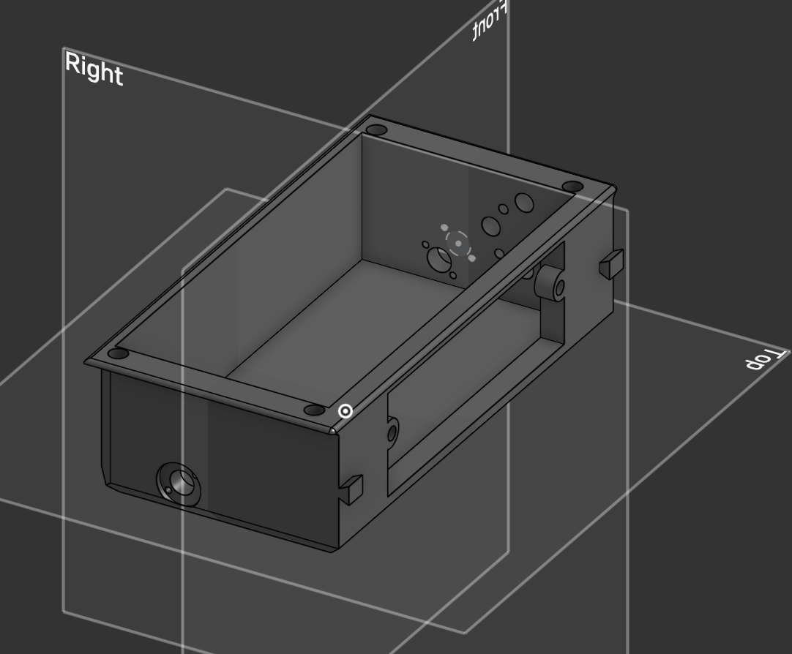
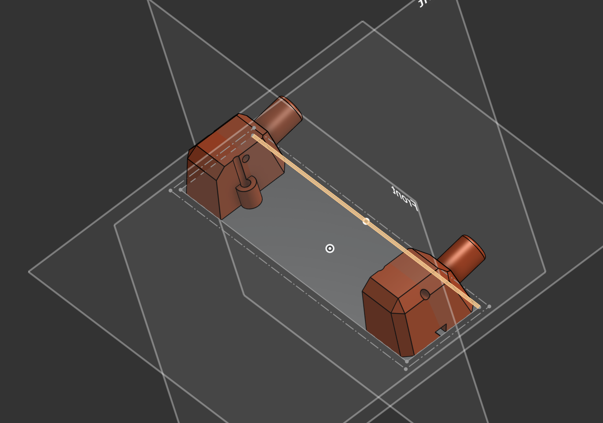
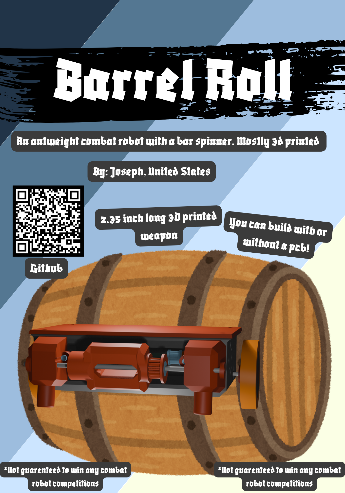

# barrel-roll

## What is this
Barrel roll is a 150g combat robot that has a 2.706693 inch long bar spinner. There are two options for the microcontroller of the robot. Right now I have a pcb designed with a RP2040 in mind. I also have a version of the schematic/firmware with an esp32 as the microcontroller.

## PCB

Above are the images of the PCB version of the electrical components of the robot(To be honest right now it feels more like a glorified pinout board)

Above is a picture of the pcb using DIP sodering. The schematic is the same as the original SMD sodered PCB.

The above is a picture of the schematic for anyone using the DOIT esp32 devkit v1. I made this one because it could cut down on the cost of the project as a whole.

## Assembly
Onshape link: https://cad.onshape.com/documents/4d0cf8c11fd66439fc3e30b0/w/a8064dfad10d7d33689fe150/e/b5006982824e862bc7271070?renderMode=0&uiState=69e65a2ccd9a40dd9e183c54

A note about the assembly: I could not find 3d models of the bearings I wanted to use so I made a model with the same dimensions as the bearings. /n
#### 3D printing
To assemble the barrel-roll you first need to print out the parts specified in the onshape document. All the parts in the FINAL folder must be printed There will be a note with the quantity and the infill amount. The fillament for all of these will be up to you. I will personally be using TPU.

### PCBs/Electronics
For this project I made several usable versions of the electronics. I did this to make sure that when it comes time for me to actually build this I can still build it even if I don't have some of the equipment that I need. The main distinction between all of the options are the different ways to soder on the microcontroller. For the no pcb method you could just use an esp32 instead of a xiao rp2040.

#### PCB SMD
IF you are using a PCB to create Barrel Roll then you need to get the Gerbers.zip from barrel-roll folder in the repo. After this you need to go to your preferred PCB manufacteror of your choice to have it manufactured.  [Gerbers.zip](barrel-roll-pcb/Gerbers.zip)
You could use [this](https://fabacademy.org/2024/labs/charlotte/students/richard-shan/lessons/week4/rp2040/) as a reference for SMD sodering the xiao RP2040.

#### PCB DIP
If you are using the DIP version of the pcb then you need to follow many of the same steps as using the SMD pcb method. However, since you are using DIP for the RP2040, sodering the PCB should be significantly simpler. [Gerbers.zip](barrel-roll-DIPPCB/Gerbers.zip)

#### No PCB
If you are not using a PCB your costs will be a little bit lower since you don't need to by the PCB. To find the wiring diagram you can look in the barrel-roll-nopcb folder of the repo. This is a kicad project that contains a wiring diagram if you have a DOIT ESP32 devkit 1(The esp32 from the electronics kits that commonly come from hackclub events).

#### Assembling the weapon system shell
In order to assemble the weapon system properly you want to make sure that you place the parts on the axle in the correct order. Axle stopper, Weapon with bearing, Axle stopper. Then you need to place the axle onto the two pieces on the Side shell.

Here is a picture of the front assembly that you should try to replicate.

#### Assembling the shell
##### For context:

The above is the main shell

The above is the side shell
For the rest of it you should look at the onshape document.

To assemble the Main shell with the Side Shells you can use the bowtie connector along side the fastening rod to attach each part of the SIDE_SHELL without the use of metal connectors. However you may find that securing the weapon/shaft/shaft caps and belt may be easier than attaching SIDE_SHELL to MAIN_SHELL immediately. After you get the side shells attached to the main shell you need to place all of the remaining electronics into the shell. After this is done you can use the heatset inserts into the holes at the top of the Main shell.

## Usage
To use barrel roll you need to connect the radio recever to the radio sender.
After this you should be able to control the robot using your controller.

## BOM
There are two BOMs one for PCB and one if you are simply using a esp32.
### BOM for PCB
 [Here is the .csv for the BOM](assets/BarrelRollerBOM.csv)
|Reference|Qty|Part               |Footprint                                                 |Supplier                                                                                                                                                                                                                                                                                                                                                                                                                                                                                                                                                                                                                                                                          |Unit Price|Total Price|Weight|SubTotal:      |$79.00 |
|---------|---|-------------------|----------------------------------------------------------|----------------------------------------------------------------------------------------------------------------------------------------------------------------------------------------------------------------------------------------------------------------------------------------------------------------------------------------------------------------------------------------------------------------------------------------------------------------------------------------------------------------------------------------------------------------------------------------------------------------------------------------------------------------------------------|----------|-----------|------|---------------|-------|
|U1       |1  |XIAO-RP2040-DIP    |Seeed Studio XIAO Series Library:XIAO-RP2040-DIP          |https://www.seeedstudio.com/XIAO-RP2040-v1-0-p-5026.html                                                                                                                                                                                                                                                                                                                                                                                                                                                                                                                                                                                                                          |$3.99     |$3.99      |      |Shipping:      |$35.37 |
|U2       |1  |DRV8833PW          |Package_DIP:DIP-16_W7.62mm                                |https://www.pololu.com/product/2130/resources                                                                                                                                                                                                                                                                                                                                                                                                                                                                                                                                                                                                                                     |$10.95    |$10.95     |      |Tax:           |$4.05  |
|U3       |1  |WeaponMotor        |Connector_PinHeader_2.54mm:PinHeader_1x03_P2.54mm_Vertical|https://itgresa.com/product/d2822-8-brushless-motor-outrunner/                                                                                                                                                                                                                                                                                                                                                                                                                                                                                                                                                                                                                    |$15.49    |$15.49     |      |Total:         |$118.42|
|U4       |1  |Recever            |Connector_PinHeader_2.54mm:PinHeader_1x04_P2.54mm_Vertical|https://radiomasterrc.com/collections/elrs-receivers/products/xr1-nano-multi-frequency-expresslrs-receiverr                                                                                                                                                                                                                                                                                                                                                                                                                                                                                                                                                                       |$11.99    |$11.99     |      |Hours Required:|23.68  |
|n/a      |2  |Bearings           |n/a                                                       |https://www.aliexpress.us/item/2271799817221155.html?spm=a2g0o.productlist.main.9.6bf0uxmMuxmMSm&algo_pvid=0084ef23-d777-4396-9fe6-be60675d223d&algo_exp_id=0084ef23-d777-4396-9fe6-be60675d223d-8&pdp_ext_f=%7B%22order%22%3A%222%22%2C%22eval%22%3A%221%22%2C%22fromPage%22%3A%22search%22%7D&pdp_npi=6%40dis%21USD%217.46%216.48%21%21%217.46%216.48%21%402101df0e17764670198046154ec5ac%2130000000002742954%21sea%21US%217446788148%21ABX%211%210%21n_tag%3A-29910%3Bd%3A67ce4d4a%3Bm03_new_user%3A-29895%3BpisId%3A5000000204886261&curPageLogUid=5TuNOIFeizbl&utparam-url=scene%3Asearch%7Cquery_from%3A%7Cx_object_id%3A20000003535907%7C_p_origin_prod%3A#nav-descriptionn|$0.65     |$1.30      |      |               |       |
|n/a      |1  |Shaft              |n/a                                                       |https://www.aliexpress.us/item/3256805290944526.html?spm=a2g0o.productlist.main.5.a97817abGkl4fC&algo_pvid=8facb9d5-b650-4910-bfe5-7eef344e1a3e&algo_exp_id=8facb9d5-b650-4910-bfe5-7eef344e1a3e-4&pdp_ext_f=%7B%22order%22%3A%225182%22%2C%22eval%22%3A%221%22%2C%22fromPage%22%3A%22search%22%7D&pdp_npi=6%40dis%21USD%212.24%210.99%21%21%2115.22%216.72%21%402101d49617762880052348351e8e1e%2112000033239843707%21sea%21US%217446788148%21ABX%211%210%21n_tag%3A-29910%3Bd%3A67ce4d4a%3Bm03_new_user%3A-29895%3BpisId%3A5000000203520907&curPageLogUid=UdRs5Z1uZKiS&utparam-url=scene%3Asearch%7Cquery_from%3A%7Cx_object_id%3A1005005477259278%7C_p_origin_prod%3A           |$0.99     |$0.99      |      |               |       |
|n/a      |1  |Heatset Inserts    |n/a                                                       |https://www.aliexpress.us/item/3256807895940353.html?spm=a2g0o.productlist.main.3.378a2b87TJWseJ&algo_pvid=cb9b5ad6-0812-433b-a087-e997f40934de&algo_exp_id=cb9b5ad6-0812-433b-a087-e997f40934de-2&pdp_ext_f=%7B%22order%22%3A%2247%22%2C%22eval%22%3A%221%22%2C%22fromPage%22%3A%22search%22%7D&pdp_npi=6%40dis%21USD%216.32%210.99%21%21%2143.01%216.75%21%40210319b017770882801392451e0fb5%2112000043603738991%21sea%21US%210%21ABX%211%210%21n_tag%3A-29910%3Bd%3A67ce4d4a%3Bm03_new_user%3A-29895%3BpisId%3A5000000203712600&curPageLogUid=BxN9cLGVkdYJ&utparam-url=scene%3Asearch%7Cquery_from%3A%7Cx_object_id%3A1005008082255105%7C_p_origin_prod%3A                      |$0.99     |$0.99      |      |               |       |
|n/a      |1  |LIPO battery       |Connector_Wire:SolderWire-2sqmm_1x01_D2mm_OD3.9mm         |https://www.racedayquads.com/products/rdq-series-11-4v-3s-720mah-100c-lihv-whoopmicro-battery-xt30                                                                                                                                                                                                                                                                                                                                                                                                                                                                                                                                                                                |$18.49    |$18.49     |      |               |       |
|XT1      |1  |XT60               |Connector_AMASS:AMASS_XT30UPB-F_1x02_P5.0mm_Vertical      |https://www.pololu.com/product/2175                                                                                                                                                                                                                                                                                                                                                                                                                                                                                                                                                                                                                                               |$2.95     |$2.95      |      |               |       |
|n/a      |2  |N20 Motor          |dc_motor                                                  |https://www.aliexpress.us/item/2255800106854951.html?spm=a2g0o.productlist.main.3.6ff81309X4dR8R&algo_pvid=1a67f37e-ad1e-40d9-b14f-8bf3408c6830&algo_exp_id=1a67f37e-ad1e-40d9-b14f-8bf3408c6830-2&pdp_ext_f=%7B%22order%22%3A%22587%22%2C%22eval%22%3A%221%22%2C%22fromPage%22%3A%22search%22%7D&pdp_npi=6%40dis%21USD%216.21%210.99%21%21%216.21%210.99%21%402101e2b617771756833746186e93f0%2110000001217668253%21sea%21US%217446788148%21ABX%211%210%21n_tag%3A-29910%3Bd%3A67ce4d4a%3Bm03_new_user%3A-29895%3BpisId%3A5000000203545005&curPageLogUid=DiJwBbgZZ32D&utparam-url=scene%3Asearch%7Cquery_from%3A%7Cx_object_id%3A4000293169703%7C_p_origin_prod%3A                |0.99      |$1.98      |      |               |       |
|n/a      |1  |PCB                |n/a                                                       |https://cart.jlcpcb.com/quote?spm=jlcpcb.Public.2006                                                                                                                                                                                                                                                                                                                                                                                                                                                                                                                                                                                                                              |$2.10     |$2.10      |      |               |       |
|         |1  |Weapon Motor Screws|n/a                                                       |https://www.homedepot.com/p/Everbilt-M3-0-5-x-12mm-Zinc-Flat-Head-Phillips-Drive-Machine-Screw-4-Pieces-837751/321071710                                                                                                                                                                                                                                                                                                                                                                                                                                                                                                                                                          |$1.95     |$1.95      |      |               |       |
|         |4  |Drive Motor Screw  |n/a                                                       |https://www.metricscrews.us/index.php?main_page=product_info&cPath=98_290_337&products_id=12400                                                                                                                                                                                                                                                                                                                                                                                                                                                                                                                                                                                   |$0.65     |$2.60      |      |               |       |
|         |1  |Timing Belt        |n/a                                                       |https://www.aliexpress.us/item/3256806230097622.html?spm=a2g0o.productlist.main.10.3c36c687BV1lAt&algo_pvid=63b5e2b7-b8a0-4ad5-994f-bdfc497c8ff9&algo_exp_id=63b5e2b7-b8a0-4ad5-994f-bdfc497c8ff9-9&pdp_ext_f=%7B%22order%22%3A%22223%22%2C%22eval%22%3A%221%22%2C%22fromPage%22%3A%22search%22%7D&pdp_npi=6%40dis%21USD%213.37%210.99%21%21%2122.92%216.72%21%402101d6fe17775973201908345e0a8a%2112000037088879424%21sea%21US%217446788148%21ABX%211%210%21n_tag%3A-29910%3Bd%3A67ce4d4a%3Bm03_new_user%3A-29895%3BpisId%3A5000000203520967&curPageLogUid=Dl3947EX6SHI&utparam-url=scene%3Asearch%7Cquery_from%3A%7Cx_object_id%3A1005006416412374%7C_p_origin_prod%3A           |$3.23     |$3.23      |      |               |       |

### BOM if you are not using a PCB
 [Here is the .csv for the BOM](assets/BarrelRollerBOMnopcb.csv)

|Reference|Qty|Part               |Footprint                                                 |Supplier                                                                                                                                                                                                                                                                                                                                                                                                                                                                                                                                                                                                                                                                          |Unit Price|Total Price|FIELD8|SubTotal:      |$72.36 |
|---------|---|-------------------|----------------------------------------------------------|----------------------------------------------------------------------------------------------------------------------------------------------------------------------------------------------------------------------------------------------------------------------------------------------------------------------------------------------------------------------------------------------------------------------------------------------------------------------------------------------------------------------------------------------------------------------------------------------------------------------------------------------------------------------------------|----------|-----------|------|---------------|-------|
|U1       |1  |XIAO-RP2040-DIP    |DOIT Esp32 devkit v1                                      |https://www.aliexpress.us/item/3256805168037961.html?spm=a2g0o.productlist.main.1.65484FTA4FTArG&algo_pvid=d1728d58-156f-4be9-9d76-2cfeae9add3a&algo_exp_id=d1728d58-156f-4be9-9d76-2cfeae9add3a-0&pdp_ext_f=%7B%22order%22%3A%226%22%2C%22eval%22%3A%221%22%7D&pdp_npi=4%40dis%21EUR%2119.50%2112.09%21%21%2121.55%2113.36%21%40211b80d117482125777598923e5f1f%2112000032724580881%21sea%21BE%214162170654%21X&curPageLogUid=5MpwdTl1HOht&utparam-url=scene%3Asearch%7Cquery_from%3A&aff_fcid=36da6fd16afa4622bbe8a19f07bf69f1-1777175912095-08109-_oC9yCzg&tt=CPS_NORMAL&aff_fsk=_oC9yCzg&aff_platform=portals-tool&sk=_oC9yCzg&aff_trace_key=36da6fd16afa4622bbe8a19f07bf69f1-1777175912095-08109-_oC9yCzg&terminal_id=b5bfa7e20bae4883861ea28de955c382&afSmartRedirect=y&gatewayAdapt=deu2usa4itemAdapt|$4.00     |$4.00      |      |Shipping:      |$35.37 |
|U2       |1  |DRV8833PW          |Package_DIP:DIP-16_W7.62mm                                |https://www.pololu.com/product/2130/resources                                                                                                                                                                                                                                                                                                                                                                                                                                                                                                                                                                                                                                     |$10.95    |$10.95     |      |Tax:           |$4.05  |
|U3       |1  |WeaponMotor        |Connector_PinHeader_2.54mm:PinHeader_1x03_P2.54mm_Vertical|https://itgresa.com/product/d2822-8-brushless-motor-outrunner/                                                                                                                                                                                                                                                                                                                                                                                                                                                                                                                                                                                                                    |$15.49    |$15.49     |      |Total:         |$111.78|
|U4       |1  |Recever            |Connector_PinHeader_2.54mm:PinHeader_1x04_P2.54mm_Vertical|https://radiomasterrc.com/collections/elrs-receivers/products/xr1-nano-multi-frequency-expresslrs-receiverr                                                                                                                                                                                                                                                                                                                                                                                                                                                                                                                                                                       |$11.99    |$11.99     |      |Hours Required:|22.36  |
|n/a      |2  |Bearings           |n/a                                                       |https://www.aliexpress.us/item/2271799817221155.html?spm=a2g0o.productlist.main.9.6bf0uxmMuxmMSm&algo_pvid=0084ef23-d777-4396-9fe6-be60675d223d&algo_exp_id=0084ef23-d777-4396-9fe6-be60675d223d-8&pdp_ext_f=%7B%22order%22%3A%222%22%2C%22eval%22%3A%221%22%2C%22fromPage%22%3A%22search%22%7D&pdp_npi=6%40dis%21USD%217.46%216.48%21%21%217.46%216.48%21%402101df0e17764670198046154ec5ac%2130000000002742954%21sea%21US%217446788148%21ABX%211%210%21n_tag%3A-29910%3Bd%3A67ce4d4a%3Bm03_new_user%3A-29895%3BpisId%3A5000000204886261&curPageLogUid=5TuNOIFeizbl&utparam-url=scene%3Asearch%7Cquery_from%3A%7Cx_object_id%3A20000003535907%7C_p_origin_prod%3A#nav-descriptionn|$0.65     |$1.30      |      |               |       |
|n/a      |1  |Shaft              |n/a                                                       |https://www.aliexpress.us/item/3256805290944526.html?spm=a2g0o.productlist.main.5.a97817abGkl4fC&algo_pvid=8facb9d5-b650-4910-bfe5-7eef344e1a3e&algo_exp_id=8facb9d5-b650-4910-bfe5-7eef344e1a3e-4&pdp_ext_f=%7B%22order%22%3A%225182%22%2C%22eval%22%3A%221%22%2C%22fromPage%22%3A%22search%22%7D&pdp_npi=6%40dis%21USD%212.24%210.99%21%21%2115.22%216.72%21%402101d49617762880052348351e8e1e%2112000033239843707%21sea%21US%217446788148%21ABX%211%210%21n_tag%3A-29910%3Bd%3A67ce4d4a%3Bm03_new_user%3A-29895%3BpisId%3A5000000203520907&curPageLogUid=UdRs5Z1uZKiS&utparam-url=scene%3Asearch%7Cquery_from%3A%7Cx_object_id%3A1005005477259278%7C_p_origin_prod%3A           |$0.99     |$0.99      |      |               |       |
|n/a      |1  |Heatset Inserts    |n/a                                                       |https://www.aliexpress.us/item/3256807895940353.html?spm=a2g0o.productlist.main.3.378a2b87TJWseJ&algo_pvid=cb9b5ad6-0812-433b-a087-e997f40934de&algo_exp_id=cb9b5ad6-0812-433b-a087-e997f40934de-2&pdp_ext_f=%7B%22order%22%3A%2247%22%2C%22eval%22%3A%221%22%2C%22fromPage%22%3A%22search%22%7D&pdp_npi=6%40dis%21USD%216.32%210.99%21%21%2143.01%216.75%21%40210319b017770882801392451e0fb5%2112000043603738991%21sea%21US%210%21ABX%211%210%21n_tag%3A-29910%3Bd%3A67ce4d4a%3Bm03_new_user%3A-29895%3BpisId%3A5000000203712600&curPageLogUid=BxN9cLGVkdYJ&utparam-url=scene%3Asearch%7Cquery_from%3A%7Cx_object_id%3A1005008082255105%7C_p_origin_prod%3A                      |$0.99     |$0.99      |      |               |       |
|n/a      |1  |LIPO battery       |Connector_Wire:SolderWire-2sqmm_1x01_D2mm_OD3.9mm         |https://www.racedayquads.com/products/rdq-series-11-4v-3s-720mah-100c-lihv-whoopmicro-battery-xt30                                                                                                                                                                                                                                                                                                                                                                                                                                                                                                                                                                                |$18.49    |$18.49     |      |               |       |
|XT1      |1  |XT60               |Connector_AMASS:AMASS_XT30UPB-F_1x02_P5.0mm_Vertical      |https://www.pololu.com/product/2175                                                                                                                                                                                                                                                                                                                                                                                                                                                                                                                                                                                                                                               |$2.95     |$2.95      |      |               |       |
|n/a      |2  |N20 Motor          |dc_motor                                                  |https://www.aliexpress.us/item/2255800106854951.html?spm=a2g0o.productlist.main.3.6ff81309X4dR8R&algo_pvid=1a67f37e-ad1e-40d9-b14f-8bf3408c6830&algo_exp_id=1a67f37e-ad1e-40d9-b14f-8bf3408c6830-2&pdp_ext_f=%7B%22order%22%3A%22587%22%2C%22eval%22%3A%221%22%2C%22fromPage%22%3A%22search%22%7D&pdp_npi=6%40dis%21USD%216.21%210.99%21%21%216.21%210.99%21%402101e2b617771756833746186e93f0%2110000001217668253%21sea%21US%217446788148%21ABX%211%210%21n_tag%3A-29910%3Bd%3A67ce4d4a%3Bm03_new_user%3A-29895%3BpisId%3A5000000203545005&curPageLogUid=DiJwBbgZZ32D&utparam-url=scene%3Asearch%7Cquery_from%3A%7Cx_object_id%3A4000293169703%7C_p_origin_prod%3A                |$0.99     |$1.98      |      |               |       |
|         |1  |Timing Belt        |n/a                                                       |https://www.aliexpress.us/item/3256806230097622.html?spm=a2g0o.productlist.main.10.3c36c687BV1lAt&algo_pvid=63b5e2b7-b8a0-4ad5-994f-bdfc497c8ff9&algo_exp_id=63b5e2b7-b8a0-4ad5-994f-bdfc497c8ff9-9&pdp_ext_f=%7B%22order%22%3A%22223%22%2C%22eval%22%3A%221%22%2C%22fromPage%22%3A%22search%22%7D&pdp_npi=6%40dis%21USD%213.37%210.99%21%21%2122.92%216.72%21%402101d6fe17775973201908345e0a8a%2112000037088879424%21sea%21US%217446788148%21ABX%211%210%21n_tag%3A-29910%3Bd%3A67ce4d4a%3Bm03_new_user%3A-29895%3BpisId%3A5000000203520967&curPageLogUid=Dl3947EX6SHI&utparam-url=scene%3Asearch%7Cquery_from%3A%7Cx_object_id%3A1005006416412374%7C_p_origin_prod%3A           |$3.23     |$3.23      |      |               |       |

### BOM PCB-DIP
 [Here is the .csv for the BOM](assets/BarrelRollerBOMDIP.csv)

|Reference|Qty|Part               |Footprint                                                 |Supplier                                                                                                                                                                                                                                                                                                                                                                                                                                                                                                                                                                                                                                                                          |Unit Price|Total Price|Weight|SubTotal:      |$79.00 |
|---------|---|-------------------|----------------------------------------------------------|----------------------------------------------------------------------------------------------------------------------------------------------------------------------------------------------------------------------------------------------------------------------------------------------------------------------------------------------------------------------------------------------------------------------------------------------------------------------------------------------------------------------------------------------------------------------------------------------------------------------------------------------------------------------------------|----------|-----------|------|---------------|-------|
|U1       |1  |XIAO-RP2040-DIP    |Seeed Studio XIAO Series Library:XIAO-RP2040-DIP          |https://www.seeedstudio.com/XIAO-RP2040-v1-0-p-5026.html                                                                                                                                                                                                                                                                                                                                                                                                                                                                                                                                                                                                                          |$3.99     |$3.99      |      |Shipping:      |$35.37 |
|U2       |1  |DRV8833PW          |Package_DIP:DIP-16_W7.62mm                                |https://www.pololu.com/product/2130/resources                                                                                                                                                                                                                                                                                                                                                                                                                                                                                                                                                                                                                                     |$10.95    |$10.95     |      |Tax:           |$4.05  |
|U3       |1  |WeaponMotor        |Connector_PinHeader_2.54mm:PinHeader_1x03_P2.54mm_Vertical|https://itgresa.com/product/d2822-8-brushless-motor-outrunner/                                                                                                                                                                                                                                                                                                                                                                                                                                                                                                                                                                                                                    |$15.49    |$15.49     |      |Total:         |$118.42|
|U4       |1  |Recever            |Connector_PinHeader_2.54mm:PinHeader_1x04_P2.54mm_Vertical|https://radiomasterrc.com/collections/elrs-receivers/products/xr1-nano-multi-frequency-expresslrs-receiverr                                                                                                                                                                                                                                                                                                                                                                                                                                                                                                                                                                       |$11.99    |$11.99     |      |Hours Required:|23.68  |
|n/a      |2  |Bearings           |n/a                                                       |https://www.aliexpress.us/item/2271799817221155.html?spm=a2g0o.productlist.main.9.6bf0uxmMuxmMSm&algo_pvid=0084ef23-d777-4396-9fe6-be60675d223d&algo_exp_id=0084ef23-d777-4396-9fe6-be60675d223d-8&pdp_ext_f=%7B%22order%22%3A%222%22%2C%22eval%22%3A%221%22%2C%22fromPage%22%3A%22search%22%7D&pdp_npi=6%40dis%21USD%217.46%216.48%21%21%217.46%216.48%21%402101df0e17764670198046154ec5ac%2130000000002742954%21sea%21US%217446788148%21ABX%211%210%21n_tag%3A-29910%3Bd%3A67ce4d4a%3Bm03_new_user%3A-29895%3BpisId%3A5000000204886261&curPageLogUid=5TuNOIFeizbl&utparam-url=scene%3Asearch%7Cquery_from%3A%7Cx_object_id%3A20000003535907%7C_p_origin_prod%3A#nav-descriptionn|$0.65     |$1.30      |      |               |       |
|n/a      |1  |Shaft              |n/a                                                       |https://www.aliexpress.us/item/3256805290944526.html?spm=a2g0o.productlist.main.5.a97817abGkl4fC&algo_pvid=8facb9d5-b650-4910-bfe5-7eef344e1a3e&algo_exp_id=8facb9d5-b650-4910-bfe5-7eef344e1a3e-4&pdp_ext_f=%7B%22order%22%3A%225182%22%2C%22eval%22%3A%221%22%2C%22fromPage%22%3A%22search%22%7D&pdp_npi=6%40dis%21USD%212.24%210.99%21%21%2115.22%216.72%21%402101d49617762880052348351e8e1e%2112000033239843707%21sea%21US%217446788148%21ABX%211%210%21n_tag%3A-29910%3Bd%3A67ce4d4a%3Bm03_new_user%3A-29895%3BpisId%3A5000000203520907&curPageLogUid=UdRs5Z1uZKiS&utparam-url=scene%3Asearch%7Cquery_from%3A%7Cx_object_id%3A1005005477259278%7C_p_origin_prod%3A           |$0.99     |$0.99      |      |               |       |
|n/a      |1  |Heatset Inserts    |n/a                                                       |https://www.aliexpress.us/item/3256807895940353.html?spm=a2g0o.productlist.main.3.378a2b87TJWseJ&algo_pvid=cb9b5ad6-0812-433b-a087-e997f40934de&algo_exp_id=cb9b5ad6-0812-433b-a087-e997f40934de-2&pdp_ext_f=%7B%22order%22%3A%2247%22%2C%22eval%22%3A%221%22%2C%22fromPage%22%3A%22search%22%7D&pdp_npi=6%40dis%21USD%216.32%210.99%21%21%2143.01%216.75%21%40210319b017770882801392451e0fb5%2112000043603738991%21sea%21US%210%21ABX%211%210%21n_tag%3A-29910%3Bd%3A67ce4d4a%3Bm03_new_user%3A-29895%3BpisId%3A5000000203712600&curPageLogUid=BxN9cLGVkdYJ&utparam-url=scene%3Asearch%7Cquery_from%3A%7Cx_object_id%3A1005008082255105%7C_p_origin_prod%3A                      |$0.99     |$0.99      |      |               |       |
|n/a      |1  |LIPO battery       |Connector_Wire:SolderWire-2sqmm_1x01_D2mm_OD3.9mm         |https://www.racedayquads.com/products/rdq-series-11-4v-3s-720mah-100c-lihv-whoopmicro-battery-xt30                                                                                                                                                                                                                                                                                                                                                                                                                                                                                                                                                                                |$18.49    |$18.49     |      |               |       |
|XT1      |1  |XT60               |Connector_AMASS:AMASS_XT30UPB-F_1x02_P5.0mm_Vertical      |https://www.pololu.com/product/2175                                                                                                                                                                                                                                                                                                                                                                                                                                                                                                                                                                                                                                               |$2.95     |$2.95      |      |               |       |
|n/a      |2  |N20 Motor          |dc_motor                                                  |https://www.aliexpress.us/item/2255800106854951.html?spm=a2g0o.productlist.main.3.6ff81309X4dR8R&algo_pvid=1a67f37e-ad1e-40d9-b14f-8bf3408c6830&algo_exp_id=1a67f37e-ad1e-40d9-b14f-8bf3408c6830-2&pdp_ext_f=%7B%22order%22%3A%22587%22%2C%22eval%22%3A%221%22%2C%22fromPage%22%3A%22search%22%7D&pdp_npi=6%40dis%21USD%216.21%210.99%21%21%216.21%210.99%21%402101e2b617771756833746186e93f0%2110000001217668253%21sea%21US%217446788148%21ABX%211%210%21n_tag%3A-29910%3Bd%3A67ce4d4a%3Bm03_new_user%3A-29895%3BpisId%3A5000000203545005&curPageLogUid=DiJwBbgZZ32D&utparam-url=scene%3Asearch%7Cquery_from%3A%7Cx_object_id%3A4000293169703%7C_p_origin_prod%3A                |0.99      |$1.98      |      |               |       |
|n/a      |1  |PCB                |n/a                                                       |https://cart.jlcpcb.com/quote?spm=jlcpcb.Public.2006                                                                                                                                                                                                                                                                                                                                                                                                                                                                                                                                                                                                                              |$2.10     |$2.10      |      |               |       |
|         |1  |Weapon Motor Screws|n/a                                                       |https://www.homedepot.com/p/Everbilt-M3-0-5-x-12mm-Zinc-Flat-Head-Phillips-Drive-Machine-Screw-4-Pieces-837751/321071710                                                                                                                                                                                                                                                                                                                                                                                                                                                                                                                                                          |$1.95     |$1.95      |      |               |       |
|         |4  |Drive Motor Screw  |n/a                                                       |https://www.metricscrews.us/index.php?main_page=product_info&cPath=98_290_337&products_id=12400                                                                                                                                                                                                                                                                                                                                                                                                                                                                                                                                                                                   |$0.65     |$2.60      |      |               |       |
|         |1  |Timing Belt        |n/a                                                       |https://www.aliexpress.us/item/3256806230097622.html?spm=a2g0o.productlist.main.10.3c36c687BV1lAt&algo_pvid=63b5e2b7-b8a0-4ad5-994f-bdfc497c8ff9&algo_exp_id=63b5e2b7-b8a0-4ad5-994f-bdfc497c8ff9-9&pdp_ext_f=%7B%22order%22%3A%22223%22%2C%22eval%22%3A%221%22%2C%22fromPage%22%3A%22search%22%7D&pdp_npi=6%40dis%21USD%213.37%210.99%21%21%2122.92%216.72%21%402101d6fe17775973201908345e0a8a%2112000037088879424%21sea%21US%217446788148%21ABX%211%210%21n_tag%3A-29910%3Bd%3A67ce4d4a%3Bm03_new_user%3A-29895%3BpisId%3A5000000203520967&curPageLogUid=Dl3947EX6SHI&utparam-url=scene%3Asearch%7Cquery_from%3A%7Cx_object_id%3A1005006416412374%7C_p_origin_prod%3A           |$3.23     |$3.23      |      |               |       |

## Poster

[Poster](Poster/Barrel%20Roller.pdf)
