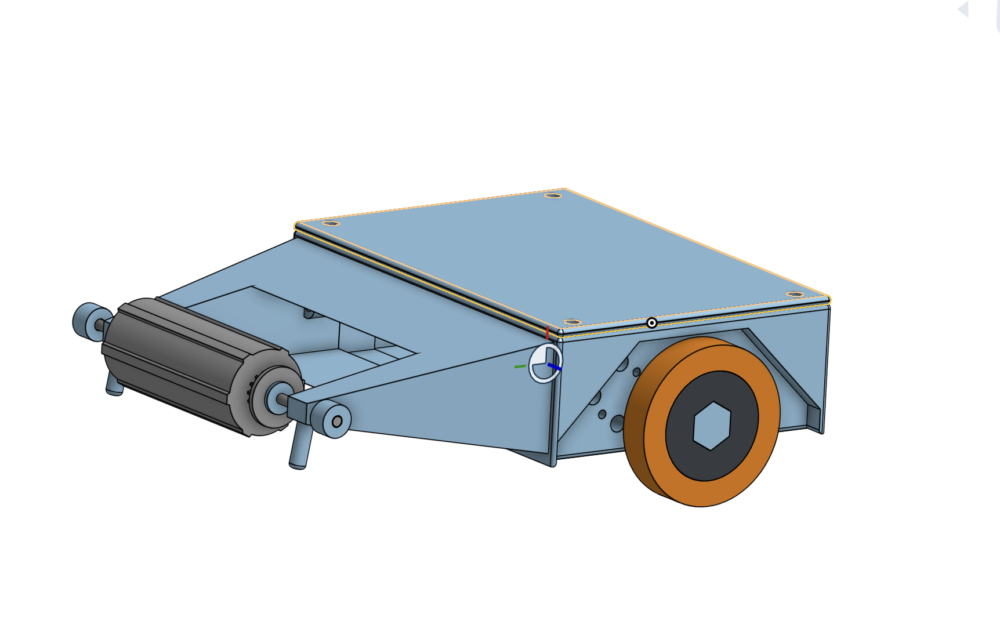

# barrel-roll

## What is this
Barrel roll is a 150g combat robot that has a 2.706693 inch long bar spinner. There are two options for the microcontroller of the robot. Right now I have a pcb designed with a RP2040 in mind. I also have a version of the schematic/firmware with an esp32 as the microcontroller.

## PCB

Above are the images of the PCB version of the electrical components of the robot(To be honest right now it feels more like a glorified pinout board)

The above is a picture of the schematic for anyone using the DOIT esp32 devkit v1. I made this one because it could cut down on the cost of the project as a whole.

## Assembly
Onshape link: https://cad.onshape.com/documents/4d0cf8c11fd66439fc3e30b0/w/a8064dfad10d7d33689fe150/e/b5006982824e862bc7271070?renderMode=0&uiState=69e65a2ccd9a40dd9e183c54

A note about the assembly: I could not find 3d models of the bearings I wanted to use so I made a model with the same dimensions as the bearings. /n
To assemble the barrel-roll 
